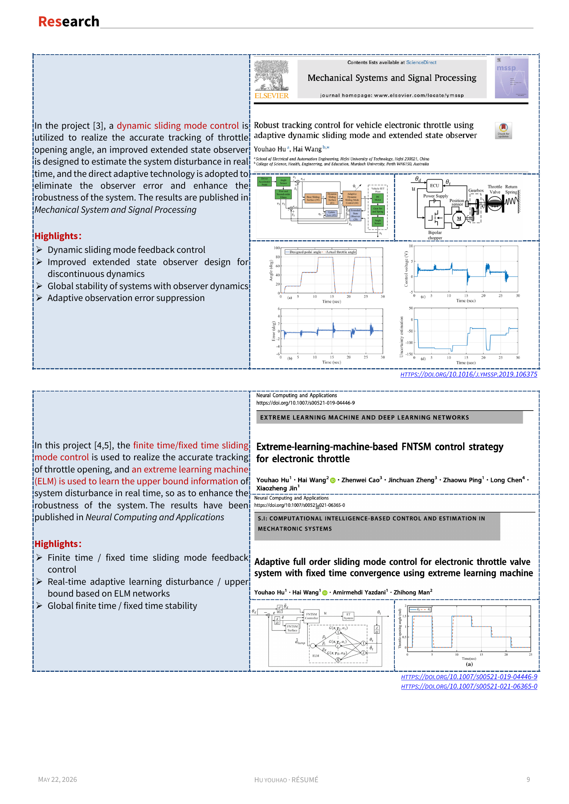

This research line develops adaptive finite-time and fixed-time sliding mode control algorithms for electronic throttle control systems. The work addresses nonlinear dynamics, robustness, convergence speed, and learning-assisted compensation.

Related papers include [(Hu et al., 2024)](https://doi.org/10.1109/TVT.2024.3438802), [(Hu et al., 2021a)](https://doi.org/10.1109/TVT.2020.3045778), [(Hu et al., 2020)](https://doi.org/10.1016/j.ymssp.2019.106375), [(Hu et al., 2020)](https://doi.org/10.1007/s00521-019-04446-9), and [(Hu et al., 2021)](https://doi.org/10.1007/s00521-021-06365-0).

